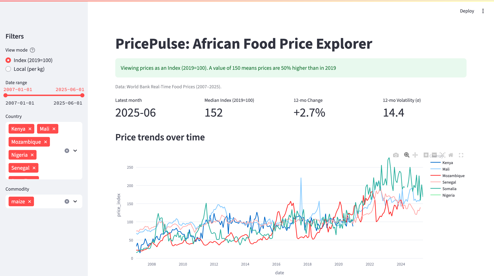

# PricePulse

I built PricePulse to explore how food prices behave across African countries, and what those movements reveal about regional trade, agriculture, and food security. This started as a small data-cleaning exercise and quickly became an attempt to make cross-country price data actually comparable and meaningful. I realized how little accessible, standardized food price data existed, even for major staples like maize or rice that millions rely on every day

---

## What This Project Does

PricePulse takes messy, country-specific food price data and transforms it into something you can analyze across borders. It allows users to compare trends, track volatility, and visualize how food markets differ across the continent

The system currently covers:

- 6 countries: Kenya, Nigeria, Mali, Mozambique, Senegal, and Somalia

- 404 markets: from rural trading posts to major urban centers

- 36,000+ price observations (2007–2025)

- 5 regions: East Africa, West Africa, Sahel, Southern Africa, and the Horn of Africa

Key commodities include maize, rice, millet, and sorghum, as well as region-specific foods. Some are shared across countries, which makes it possible to compare them directly

---

## Why It Matters

Food price data isn’t just about economics; It reflects climate shocks, political stability, and trade systems. By cleaning and unifying this information, we can start answering questions like:

- Why do prices move together across borders in some years, but not others?

- Which markets are most volatile?

- How are global events (like COVID-19 or the 2022 food crisis) visible in local markets?

---

## How It Works

This project uses a modular Python setup that allows each country’s data to be cleaned separately, then merged into a single unified dataset

Main components:

- processing/: Country-specific cleaners for different formats

- multi_country/: Unified processor that merges and reshapes data

- dashboard/: Interactive Streamlit dashboard for exploring results

- Core technologies: pandas, numpy, matplotlib, plotly, and streamlit

---

## The Data Challenge

Each country collects data differently; Different currencies, market names, even different spellings for the same commodity. Building a pipeline that could align all of these took iteration and patience.

I used the World Bank Real-Time Food Prices database as the primary source because it’s the most standardized and frequently updated. Even then, I had to handle issues like:

- Missing or misaligned dates

- Varying frequency (weekly vs monthly)

- Currency differences (KES, NGN, CFA, SOS, etc.)

- Datasets with 50+ columns of related food items

---


## Making Prices Comparable

Cross-country comparisons don’t mean much unless prices are normalized. Here’s how I handled it:

1. Reshaping the data from wide (each commodity in its own column) to long format (country | date | commodity | price)

2. Creating an Index (2019 = 100) for every country–commodity pair

    2.1. This means that an index value of 150 shows prices are 50% higher than in 2019

3. Building a Streamlit dashboard that lets users toggle between:

    3.1. Local currency (raw prices)

    3.2. Index (comparable trends)

This approach focuses on shape (change over time) rather than absolute currency values; A cleaner way to compare across different economies

---

## Dashboard Preview


## Dashboard

The dashboard provides a visual way to explore Africa’s food price landscape. You can switch between local prices and Index (2019=100) mode to compare price movements across countries

Key visualizations:

1. Trend lines: How prices evolve over time across countries

2. Cross-country comparison: Average prices for a selected commodity

3. Distribution & volatility: How stable each market is

4. KPIs:

    4.1. 12-month change: Are prices rising or falling compared to last year?

    4.2. Volatility: How stable are prices over the past 12 months?

Together, these give a quick sense of which markets are heating up, stabilizing, or diverging

Run locally:
streamlit run src/dashboard/streamlit_app.py


NOTE: Dashboard can be run locally with Streamlit or deployed to Streamlit Cloud.
---

## Project Structure

```
PricePulse/
├── data_sources/
│   ├── raw/                    # Downloaded World Bank data
│   └── processed/              # Cleaned, unified datasets
├── src/
│   ├── multi_country/          # Cross-country analysis engine
│   ├── processing/             # Country-specific data cleaners
│   └── analysis/               # Individual country analysis
```

--- 

## Early Insights

- Regional patterns: Maize dominates East Africa; rice is more central in West Africa

- Price volatility: Somalia and Mozambique show sharper price swings, possibly linked to supply disruptions

- Currency effects: Without normalization, local-currency plots make Somalia look exaggerated — the index view fixes this

- Post-2020 inflation: All countries show a visible jump in prices, consistent with global food inflation trends

---


## What I Learned

- Real-world data is rarely clean or comparable

- Designing scalable code from the start saves hours of rework later

- Cross-country analysis demands both technical rigor and contextual understanding (agriculture, currency, policy)

- Good data storytelling requires context, not just code

This project made me think about how data engineering intersects with development and how better information can shape smarter decisions

---

## Running the Pipeline

You can rebuild the dataset and launch the dashboard locally in just a few steps:

```bash
# 1.Clone the repository
git clone https://github.com/christaingabire/PricePulse.git
cd PricePulse

# 2️. Run country-specific data cleaners
python src/processing/clean_mali.py
python src/processing/clean_senegal.py
# ...repeat for other countries as needed

# 3️. Build the unified dataset (adds 2019=100 Index)
python src/multi_country/build_unified.py

# 4️. Launch the interactive dashboard
streamlit run src/dashboard/streamlit_app.py

Requirements: pandas, numpy, matplotlib, plotly, streamlit

Note: The unified dataset (unified_multi_country.csv) is generated locally via the build script and excluded from version control due to file size
```
--- 

## Next Steps

- Add more countries (Ethiopia, DRC, South Sudan) for broader coverage

- Integrate currency normalization (USD) and inflation-adjusted (real) prices

- Explore seasonality analysis (harvest vs. lean months)

- Add a rolling volatility chart and crisis alerting feature

---

## Data Sources

- World Bank: Real-Time Food Prices Database

- National agricultural ministries: For local validation

- FAO: Market monitoring and crisis updates

The World Bank data has been comprehensive and well-maintained across countries

---

## Demo Notebook

NOTE: This needs to be updated to reflec the current data

See the platform in action: **[View Demo Notebook](demo.ipynb)**

The demo shows:
- 36,000+ observations across 6 African countries
- Cross-country sorghum price analysis (5 countries)
- Regional food system comparisons
- Conflict zone monitoring capabilities

---

I'm a data engineer with an interest in how data systems and social systems overlap. I believe good public data can change how we understand markets, development, and everyday life across Africa
